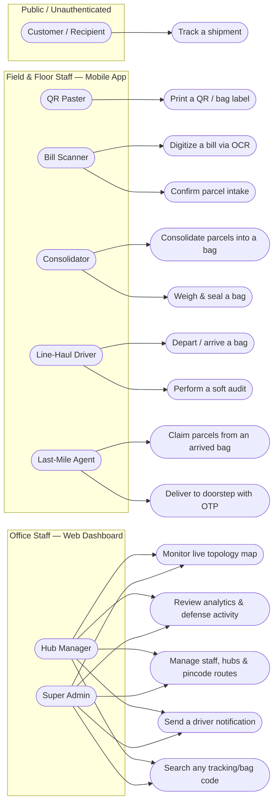
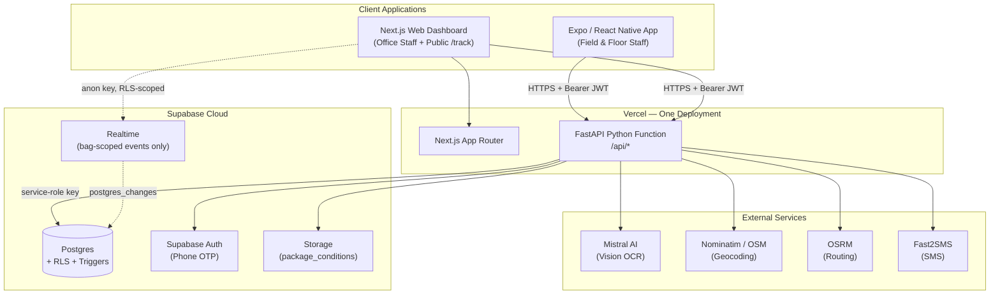
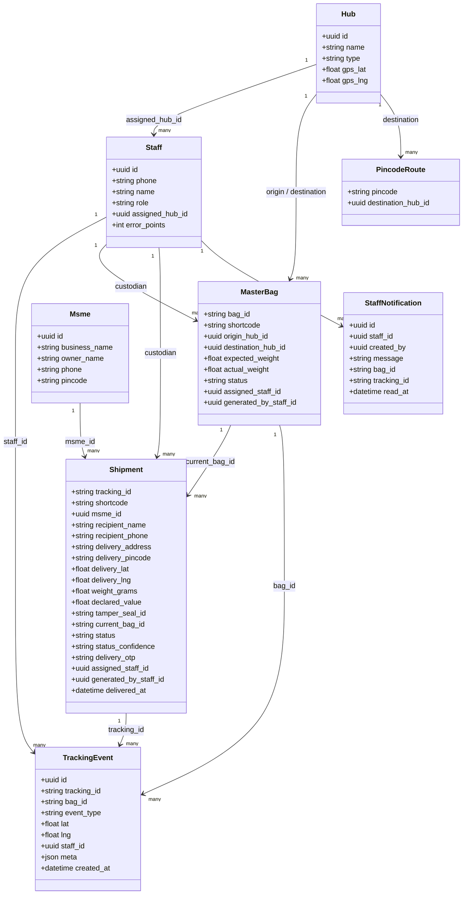
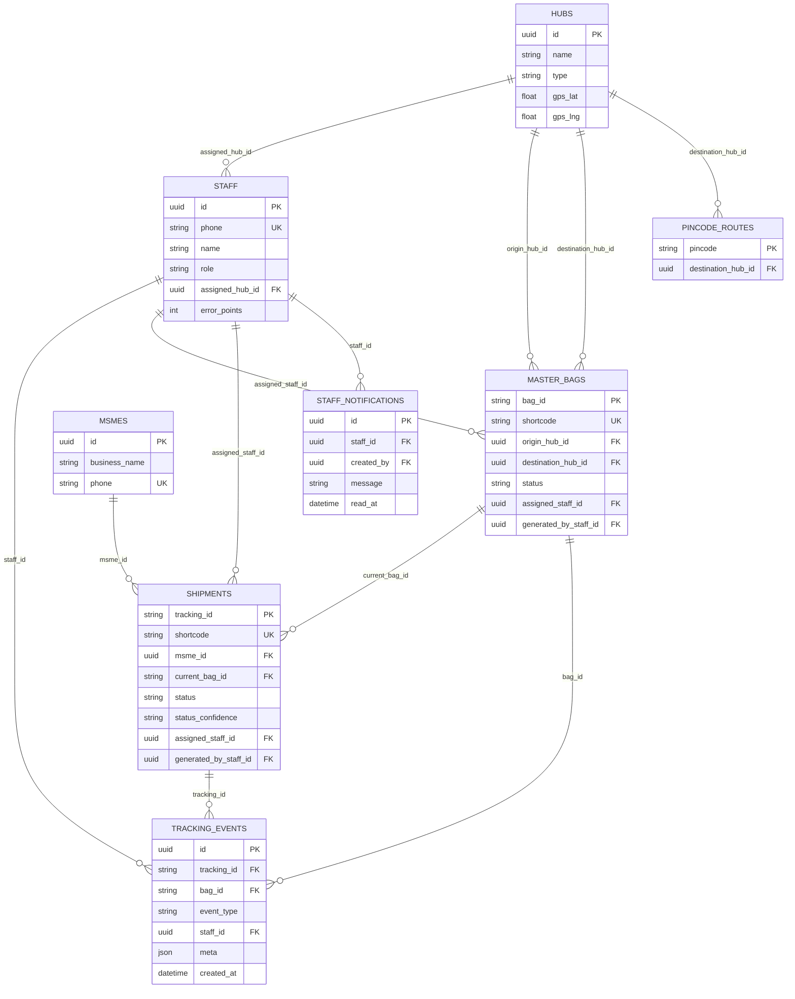
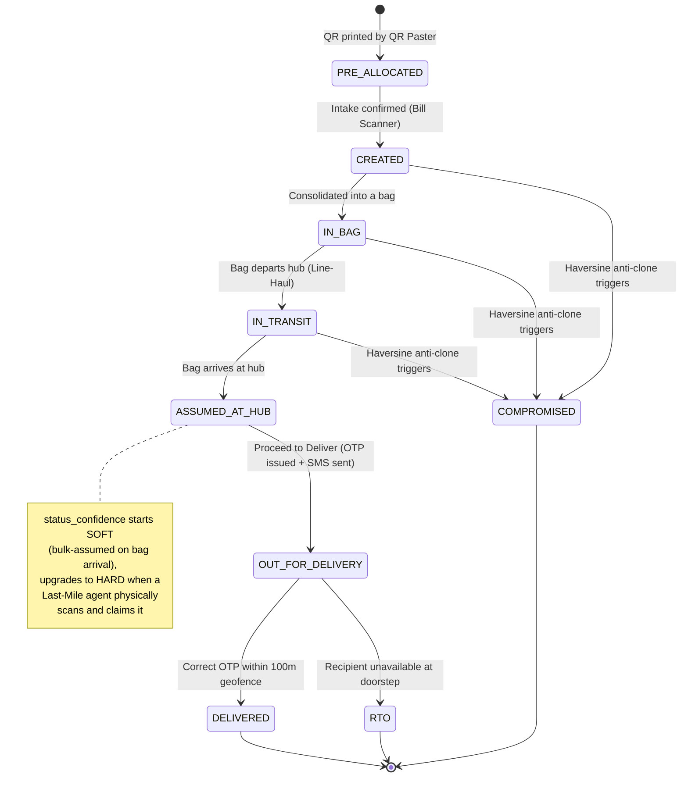
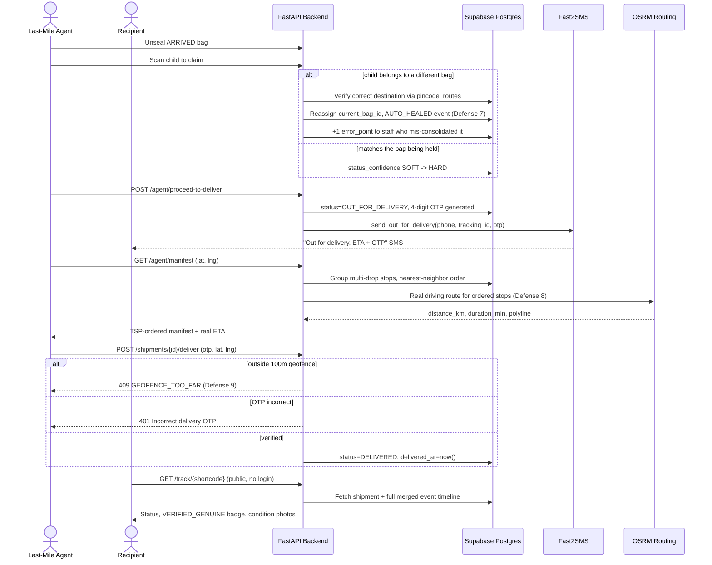

# LOCUS — Technical Documentation & Project Report

*The Exact Point of Truth — a state-aware 3PL logistics operating system for MSMEs*

This document is a complete technical reference for the LOCUS codebase as it exists today: a FastAPI backend, a Next.js web dashboard, an Expo/React Native mobile app, and a Supabase (Postgres) database, deployed as a single Vercel project. Every claim below is traced to an actual file in the repository — nothing here is aspirational or roadmap; it describes what is built and running.

## Table of Contents

1. [System Architecture & Technical Specifications](#1-system-architecture--technical-specifications)
2. [Backend Architecture & Functionality](#2-backend-architecture--functionality)
3. [Features & Module Breakdown](#3-features--module-breakdown)
4. [User Workflows (Step-by-Step)](#4-user-workflows-step-by-step)
5. [Security, Defense Mechanisms & Credentials](#5-security-defense-mechanisms--credentials)
6. [UML Diagrams](#6-uml-diagrams)
7. [Illustrative Example](#7-illustrative-example)

---

## 1. System Architecture & Technical Specifications

### 1.1 Why a monorepo, single-deployment design

LOCUS is one repository containing three client-facing applications (`/web`, `/mobile`, `/backend`) plus the database schema (`/supabase/migrations`). All three clients speak to exactly one backend — nothing talks to Supabase directly except two narrow, deliberate exceptions covered in §5. This is a design constraint, not an accident: it means every authorization rule, every anti-fraud check, and every business invariant lives in one place (Python, in FastAPI) instead of being duplicated — and potentially drifting — across a web client, a mobile client, and a set of database policies.

### 1.2 Software stack

| Layer | Technology | Version (pinned) | Why this, specifically |
|---|---|---|---|
| Backend framework | FastAPI | 0.115.0 | Async-native, so a request that calls out to three slow external HTTP APIs (OCR, geocoding, routing) doesn't block a worker thread; automatic OpenAPI/Pydantic validation removes an entire category of "the client sent malformed JSON" bugs. |
| ASGI server | Uvicorn | 0.30.6 | Standard FastAPI companion; also what Vercel's Python runtime wraps for serverless execution. |
| Data models & validation | Pydantic | 2.9.2 | Every request body and response is a typed model — a wrong field type is a 422 before any business logic runs, not a `KeyError` three lines into a handler. |
| Settings management | pydantic-settings | 2.5.2 | Typed, validated environment variables (`Settings` in `config.py`) — a missing required var fails loudly at startup rather than as a mysterious `None` deep in a request. |
| Auth token handling | python-jose[cryptography] | 3.3.0 | Mints and verifies the app's own session JWTs (HS256). |
| HTTP client | httpx | 0.27.2 | The one client used for every outbound integration call (Mistral, Nominatim, OSRM, Fast2SMS) — async-compatible, unlike `requests`. |
| Database/BaaS client | supabase-py | 2.7.4 | Wraps Postgres access, Auth admin operations, and Storage uploads behind one client object. |
| Date parsing | python-dateutil | 2.9.0 | Parses ISO-8601 timestamps from Postgres/clients without the footguns of `datetime.fromisoformat` across Python versions. |
| Multipart uploads | python-multipart | 0.0.9 | Backs FastAPI's `UploadFile` for bill/condition photo uploads. |
| Web framework | Next.js (App Router) | 14.2.35 | One project serves both the SSR'd staff dashboard and the public `/track/[id]` page; the App Router's file-based routing maps directly onto the app's role-based destinations (`/dashboard`, `/printer`, `/account`). |
| Web UI runtime | React | 18.3.1 | — |
| Web styling | Tailwind CSS | 3.4.13 | Design tokens (see §1.4) shared conceptually with the mobile app via NativeWind, so both surfaces render the same visual language from two independent Tailwind configs kept deliberately in sync. |
| Web state | Zustand | 4.5.5 | Minimal-boilerplate persisted stores (auth session, theme, locale) — no reducers/actions ceremony for what is fundamentally "remember three small values across reloads." |
| Realtime | @supabase/supabase-js | 2.112.3 | The *only* place any client talks to Supabase directly — a narrow, anon-key, RLS-gated Realtime subscription (see §5.4). |
| Mapping | Leaflet + react-leaflet | 1.9.4 / 4.2.1 | Free, no API key, renders the Live Topology Map's hubs/trucks/reroute polylines over OpenStreetMap tiles. |
| Animation | GSAP + MotionPathPlugin | 3.12.5 | Drives the two-second "dot travels a grid line" intro on the public tracking page — the one deliberately branded moment in the whole app. |
| QR rendering | qrcode.react | 3.1.0 | Renders the Digital Printer's on-screen QR code for physical printing. |
| Mobile framework | Expo (SDK 57) / React Native | 57.0.14 / 0.86.2 | One codebase covers Android and iOS for every field/floor role — camera (QR + photo capture) and GPS access via Expo's managed native modules, no separate native builds to maintain. |
| Mobile UI runtime | React | 19.2.3 | — |
| Mobile routing | expo-router | 57.0.14 | File-based routing mirroring the web app's structure; typed routes enabled. |
| Mobile styling | NativeWind | 4.2.6 | Tailwind syntax compiled to React Native styles — the mobile `tailwind.config.js` mirrors `web/tailwind.config.ts`'s palette by hand (documented in a comment in both files). |
| Mobile camera | expo-camera | 57.0.3 | QR barcode scanning (with real per-frame bounding-box overlay) and bill/condition photo capture. |
| Mobile image processing | expo-image-manipulator | 57.0.11 | Client-side photo resize before upload — see §3 for why this matters. |
| Mobile geolocation | expo-location | 57.0.11 | One-shot fixes for scan events, and a continuous `watchPositionAsync` stream for the live geofence check during delivery. |
| Mobile local persistence | @react-native-async-storage/async-storage | 2.2.0 | Backs every persisted Zustand store: auth session, offline action queue, theme. |
| Mobile connectivity | @react-native-community/netinfo | 12.0.1 | Powers the offline/online detection behind the Split-Brain Fix (§3, §4). |
| Database | PostgreSQL (via Supabase) | — | Full relational integrity (foreign keys, enums, check constraints) for a domain that is fundamentally about state machines and referential correctness — a package is either in a bag or it isn't. |

### 1.3 Cloud infrastructure ("hardware") equivalents

LOCUS has no traditional servers. Every "hardware" requirement below is a managed cloud service or a piece of client hardware LOCUS already assumes staff carry:

| Traditional H/W role | LOCUS's cloud/device equivalent |
|---|---|
| Application server | Vercel Serverless Functions (Python runtime, auto-scaled, zero always-on cost) |
| Web/static server | Vercel's Next.js hosting (edge CDN + SSR) |
| Database server | Supabase-managed Postgres (provisioned, backed up, and patched by Supabase) |
| Auth server | Supabase Auth (phone OTP, admin user provisioning API) |
| Object/file storage | Supabase Storage (`package_conditions` bucket) |
| Message broker / pub-sub | Supabase Realtime (Postgres logical replication over WebSocket) |
| Barcode/label printer | Any desktop + browser + physical printer, driven by the Digital Printer web page (`/printer`) — literally "print this QR code and paste it on the box" |
| Handheld scanner | The staff member's own Android/iOS phone camera, via `expo-camera` |
| GPS unit | The staff member's own phone GPS, via `expo-location` |

This is a deliberate choice: a hackathon-viable, near-zero-fixed-cost infrastructure that still enforces real relational integrity and real authorization — not a toy in-memory prototype.

### 1.4 Shared design system

Both frontends draw from one documented palette, defined once as a comment block in `web/tailwind.config.ts` and mirrored in `mobile/tailwind.config.js`:

- **Warm Ivory** `#F8F5EF` — background
- **Deep Navy** `#172B3A` — text & primary surfaces
- **Cobalt-Indigo** `#4F46E5` — primary actions
- **Burnt Orange** `#E76F2F` — active scans / warehouse actions
- **Muted Sage** `#6B8F71` — success states
- **Brick-Red** `#B84A3A` — errors, exceptions, quarantine

Typography: Newsreader (serif, headings) + IBM Plex Sans (body) + IBM Plex Mono (every ID, timestamp, and scan code — deliberately monospaced so a tracking ID or shortcode is always visually unambiguous). The web app additionally chains in Noto Sans Telugu and Noto Sans Devanagari as font-stack fallbacks (not per-locale font switches) so Telugu and Hindi UI text renders correctly without any locale-conditional font logic — the browser simply pulls each glyph from whichever font in the stack actually has it.

Dark mode on web is implemented as CSS-variable-backed Tailwind colors (`rgb(var(--color-navy) / <alpha-value>)`), flipped in one place via a `[data-theme="dark"]` block — every existing `bg-ivory`/`text-navy` class in the app repaints correctly without per-component dark-mode variants.

### 1.5 How it all fits together

```
Staff phone (Expo app)  ───
                          ───▶  FastAPI (/api/*, Vercel Python function)  ───▶  Supabase Postgres (service-role key, bypasses RLS)
Browser (Next.js app)    ──         │                                          │
        │                            ───▶ Mistral AI (bill OCR)                 ───▶ Supabase Auth / Storage
        ─── anon-key Realtime ───────┼──▶ Nominatim (geocoding)
            (bag-scoped only)        ───▶ OSRM (routing/ETA)
                                      ───▶ Fast2SMS (customer SMS)
```

Next.js and the FastAPI function are deployed as **one Vercel project** (`vercel.json`): requests to `/api/(.*)` route to `api/index.py` (a thin shim that imports the real `backend/app` FastAPI app onto Python's import path), everything else routes to the Next.js build. This means web and backend ship together, on one domain, with no CORS configuration needed in production — CORS middleware in `main.py` exists purely for local development, where the Next dev server and `uvicorn` run on different ports.

---

## 2. Backend Architecture & Functionality

### 2.1 Layered structure

```
backend/app/
├── main.py            FastAPI app assembly, CORS, /api prefix, /api/health
├── routers/            HTTP boundary — one file per feature area, thin
├── core/               Business logic, integrations, shared helpers
├── models/              Pydantic request/response schemas, one file per phase/feature
└── seed.py              Idempotent local-dev database seeding script
```

The separation is strict and consistent across all fourteen routers: a router function extracts and validates the request (via a Pydantic model and a `Depends(require_roles(...))` auth check), delegates all actual logic to `core/` functions, and returns a Pydantic response model. No router file talks to an external API directly — that always goes through a `core/` module (`geocode.py`, `osrm.py`, `vision_ocr.py`, `fast2sms.py`).

### 2.2 Request lifecycle

1. **Transport**: client sends `Authorization: Bearer <JWT>` (except `/track/{code}`, `/auth/request-otp`, `/auth/verify-otp`, which are intentionally public).
2. **Authentication** (`core/security.py`): `get_current_staff` decodes the JWT via `python-jose`, then **re-fetches the staff row from Postgres by the decoded `staff_id`** on every single request — it never trusts the role/hub embedded in the token payload for authorization decisions, only for identity. This is deliberate: if a Super Admin changes someone's role or reassigns their hub, that change takes effect on their very next API call, with no forced re-login.
3. **Authorization**: `require_roles(*allowed)` wraps `get_current_staff` and 403s if the fetched role isn't in the allowed set. Hub-scoping (`core/hub_scope.py::resolve_scope_hub_id`) is a second, separate authorization layer used by every `/admin/*` endpoint: a Hub Manager is hard-locked to `staff.assigned_hub_id`; a Super Admin gets the full network by default, or can pass `preview_hub_id` to see exactly what a given Hub Manager sees (itself gated — a real Hub Manager who tries to pass `preview_hub_id` gets a 403, not a silent ignore).
4. **Business logic**: the relevant `core/` module executes, performing whatever defense checks apply (see §5), and issues one or more Supabase calls via the shared `get_admin_client()` — a service-role client, cached with `@lru_cache`, that bypasses Postgres RLS entirely. FastAPI, not Postgres, is the real authorization boundary; RLS is a defense-in-depth backstop (§5.3).
5. **Ledger write**: almost every state-changing action inserts one or more rows into `tracking_events` — an append-only table enforced by a Postgres trigger that rejects `UPDATE`/`DELETE` even for the service-role key (§5.3). This table is the system's single source of historical truth; the public tracking page, the staff activity feed, the analytics dashboard, and the Live Topology Map are all just different views over it.
6. **Response**: the handler constructs and returns a typed Pydantic model; FastAPI serializes it to JSON. Validation errors never leak Python internals — every deliberate rejection raises `HTTPException` with a structured `detail` (`{"code": "...", "message": "...", ...extra fields}`), which both frontends' `ApiError` classes know how to unpack into a specific, actionable UI message rather than a generic "something went wrong."

### 2.3 The `fetch_one` helper — a real, documented gotcha

`core/supabase_client.py::fetch_one` exists because of a genuine bug class: the installed `postgrest-py` version returns a bare `None` (not a response object with `.data = None`) when a `.maybe_single()` query matches zero rows. Every "not found" lookup in the entire backend goes through `fetch_one()` rather than calling `.execute()` directly on a `.maybe_single()` builder, specifically to normalize this away in one place instead of forty.

### 2.4 Sequential ID generation

Tracking IDs (`TRK-000001`) and bag IDs (`BAG-000001`) are generated by Postgres sequences (`shipment_id_seq`, `bag_id_seq`) via SQL functions `next_tracking_id()`/`next_bag_id()` (migration `0002`), called through `core/ids.py`. This is deliberately **not** "count existing rows + 1" — that pattern produces duplicate IDs under concurrent requests (two staff members hitting "Generate" on the Digital Printer at the same moment); a database sequence is atomic by construction. Each ID is paired with a random 6-character shortcode (`core/ids.py::generate_shortcode`, alphabet excludes visually ambiguous characters `0/O/1/I`) — this is the fallback code printed under every QR label, and, since migration-era hardening, also the public-facing identifier used in tracking links (see §5.5).

### 2.5 API surface

All routes are mounted under `/api` (`main.py`). Full endpoint inventory:

| Router | Method & Path | Purpose | Roles |
|---|---|---|---|
| `auth` | `POST /auth/request-otp` | Send phone OTP (or report demo bypass available) | public |
| | `POST /auth/verify-otp` | Verify OTP, mint session JWT | public |
| | `GET /auth/me` | Current staff profile | any staff |
| | `GET /auth/me/activity` | Self activity feed (today/total counts of *distinct packages/bags touched*, error points, recent events) | any staff |
| `printer` | `POST /printer/generate` | Generate one `TRK-`/`BAG-` QR + shortcode, stamped with generating staff + hub | QR_PASTER, HUB_MANAGER, SUPER_ADMIN |
| | `GET /printer/history` | A QR Paster's own generation history, date-range filterable | QR_PASTER |
| `ocr` | `POST /ocr/bill` | Bill photo → extracted fields (multipart) | any staff |
| | `POST /ocr/bill-base64` | Same, JSON/base64 (Android multipart workaround) | any staff |
| `shipments` | `GET /msmes/by-phone/{phone}` | MSME lookup | any staff |
| | `GET /shipments/{tracking_id}` | Shipment detail | any staff |
| | `POST /shipments/{tracking_id}/intake` | Confirm intake | BILL_SCANNER, SUPER_ADMIN |
| | `POST /shipments/{tracking_id}/condition-photos` | Upload condition photos (multipart) | BILL_SCANNER, SUPER_ADMIN |
| | `POST /shipments/{tracking_id}/condition-photos-base64` | Same, JSON/base64 | BILL_SCANNER, SUPER_ADMIN |
| `consolidation` | `GET /bags/{bag_id}` | Bag detail | CONSOLIDATOR, LINE_HAUL, LAST_MILE, HUB_MANAGER, SUPER_ADMIN |
| | `POST /bags/{bag_id}/bind` | Bind destination hub | CONSOLIDATOR, SUPER_ADMIN |
| | `POST /bags/{bag_id}/scan-child` | Consolidate a parcel into a bag | CONSOLIDATOR, SUPER_ADMIN |
| | `POST /bags/{bag_id}/dispatch` | Weigh & seal | CONSOLIDATOR, SUPER_ADMIN |
| `linehaul` | `POST /bags/{bag_id}/depart` | Mark bag departed | LINE_HAUL, SUPER_ADMIN |
| | `POST /bags/{bag_id}/arrive` | Mark bag arrived | LINE_HAUL, SUPER_ADMIN |
| | `POST /sync/bag-events` | Replay offline-queued depart/arrive events | LINE_HAUL, SUPER_ADMIN |
| `lastmile` | `POST /bags/{bag_id}/unseal` | Unseal an arrived bag | LAST_MILE, SUPER_ADMIN |
| | `POST /bags/{bag_id}/claim-child` | Claim a parcel from an unsealed bag | LAST_MILE, SUPER_ADMIN |
| | `GET /agent/claimed` | Currently-claimed, not-yet-locked parcels | LAST_MILE, SUPER_ADMIN |
| | `POST /agent/proceed-to-deliver` | Lock manifest, issue OTPs, send SMS | LAST_MILE, SUPER_ADMIN |
| | `GET /agent/manifest` | TSP-ordered delivery stops + real ETA | LAST_MILE, SUPER_ADMIN |
| | `POST /shipments/{tracking_id}/deliver` | Confirm doorstep delivery (OTP + geofence) | LAST_MILE, SUPER_ADMIN |
| | `POST /shipments/{tracking_id}/rto` | Mark return-to-origin | LAST_MILE, SUPER_ADMIN |
| `resolve` | `GET /resolve/{code}` | Shortcode/prefix → concrete parcel or bag ID | any staff |
| `hubs` | `GET /hubs` | List all hubs | any staff |
| `admin` | `GET /admin/kpis` | Network/hub KPIs | HUB_MANAGER, SUPER_ADMIN |
| | `GET /admin/active-transits` | Live Topology Map data | HUB_MANAGER, SUPER_ADMIN |
| | `GET /admin/bottlenecks` | AI Bottleneck Auditor | HUB_MANAGER, SUPER_ADMIN |
| | `GET /admin/security-events` | Compromised/auto-healed event feed | HUB_MANAGER, SUPER_ADMIN |
| | `GET /admin/staff-lookup` | Resolve bare staff UUIDs (from Realtime) to names | HUB_MANAGER, SUPER_ADMIN |
| | `GET/POST /admin/staff` | List / create staff | HUB_MANAGER, SUPER_ADMIN |
| | `DELETE /admin/staff/{id}` | Remove staff | HUB_MANAGER, SUPER_ADMIN |
| | `POST /admin/hubs`, `DELETE /admin/hubs/{id}` | Create/delete hub | SUPER_ADMIN |
| | `GET/POST /admin/pincode-routes`, `DELETE /admin/pincode-routes/{code}` | Manage pincode routing | HUB_MANAGER, SUPER_ADMIN |
| | `GET /admin/search-tracking` | Resolve any tracking ID, bag ID, or shortcode to full detail + staff-annotated timeline | HUB_MANAGER, SUPER_ADMIN |
| `analytics` | `GET /admin/analytics` | Full defense/throughput/leaderboard/value/MSME/routing-gap/QR-generation dashboard | HUB_MANAGER, SUPER_ADMIN |
| `driver_link` | `GET /admin/staff/{id}/manifest` | What a staff member currently, physically holds | HUB_MANAGER, SUPER_ADMIN |
| | `POST /admin/staff/{id}/notify` | Send a non-authoritative nudge | HUB_MANAGER, SUPER_ADMIN |
| | `GET /notifications/mine` | My unread notifications | any staff |
| | `POST /notifications/{id}/ack` | Acknowledge a notification | any staff |
| `msme_admin` | `GET /admin/msmes`, `GET /admin/msmes/{id}` | MSME directory & detail (shipment rows include assigned staff, pincode, weight, current bag, timestamps) | HUB_MANAGER, SUPER_ADMIN |
| `track` | `GET /track/{code}` | Public, unauthenticated tracking | public |
| `main` | `GET /api/health` | Liveness + config diagnostics | public |

### 2.6 Resilience pattern: config errors can never take down the whole API

`main.py` wraps `get_settings()` in a broad `try/except` at *module import time*. Historically, one missing environment variable on a fresh deployment took down every single route — including `/api/health` — as an opaque Vercel `FUNCTION_INVOCATION_FAILED` with no indication why. Now, a config failure is caught, logged, and surfaced as a readable `{"status": "misconfigured", "detail": "..."}` from `/api/health` itself, while the rest of the app still imports (routes that actually need the missing setting will fail individually, with their own clear error, when called — but the app boots and can diagnose itself).

---

## 3. Features & Module Breakdown

Each module below is described as: **what** it is, **why** it exists, and **how** it works internally.

### 3.1 Digital Printer (`printer.py` + `core/ids.py`)

**What**: A web page (`/printer`, role-gated to `QR_PASTER`/`HUB_MANAGER`/`SUPER_ADMIN`) that generates one QR code at a time — a `TRK-######` sticker for a parcel or a `BAG-######` sticker for a master bag — stamped with a generated-at timestamp and the generating staff member's hub, with a real fixed-size (4×6in) print action producing a proper physical label, not a screenshot stand-in.

**Why**: Every physical object in the system needs a scannable, globally-unique identity *before* anything is known about it (a blank sticker gets pasted on a box, then the bill is scanned later). One-at-a-time generation deliberately matches the real physical pace of peeling and pasting one sticker before requesting the next — there is no "Generate Batch of 50" button, because that isn't how a QR Paster actually works. A second **History** tab lets a QR Paster see everything *they personally* generated, filtered by date — hard-scoped so no QR Paster sees another's activity.

**How**: `POST /printer/generate` calls a Postgres sequence function (`next_tracking_id()`/`next_bag_id()`), inserts a `PRE_ALLOCATED` row immediately (so the ID exists in the database the instant it's printed, before it's ever scanned again) tagged with `generated_by_staff_id`, and returns `{id, shortcode, created_at, generated_by_hub_name}`. The web page renders this as an on-screen QR via `qrcode.react` for physical printing, plus a dedicated `@media print` stylesheet that isolates just the label (logo, QR, shortcode, type, stamp) at a fixed 4×6in size when the Print button is used.

### 3.2 OCR Bill Digitization (`ocr.py` + `core/vision_ocr.py`)

**What**: Photographs a paper waybill/invoice and extracts structured fields (names, phones, address, pincode, declared value, weight) via a vision-language model.

**Why**: MSME shippers hand over paper bills, not structured data. Manual re-typing is slow and error-prone; OCR gets a first-pass form pre-fill that staff can (and are always shown as editable, never trusted blindly) correct.

**How**: The image is base64-encoded and sent to Mistral AI's `ministral-8b-latest` chat-completions endpoint with a strict system prompt demanding a single JSON object matching `OcrExtractOut`'s fields, `temperature=0`, and `response_format: json_object`. Two upload paths exist for the same operation — a real multipart `UploadFile` (`/ocr/bill`) and a JSON/base64 body (`/ocr/bill-base64`) — because Android's native multipart `FormData` streaming was found to crash unpredictably; the base64 path is the mobile app's actual default. Every OCR failure surfaces its *real* reason (timeout vs. malformed response vs. unreadable image) all the way to the UI — an earlier version collapsed every failure into one indistinguishable "couldn't read the bill" message, which made a genuinely broken upload indistinguishable from a blurry photo.

> **Provider note**: the project originally specced Groq for this. As of this build, Groq has zero working vision-capable chat models (every Llama vision variant is decommissioned) — confirmed via a live API call, not assumed from documentation. Mistral is the verified, currently-live replacement.

### 3.3 Geocoding (`core/geocode.py`)

**What**: Converts a free-text delivery address + pincode into `(lat, lng)` coordinates via Nominatim (OpenStreetMap's free geocoder).

**Why**: This is the ground truth that Defense 9 (doorstep geofencing) is measured against later. Critically, this is a *separate backend step from OCR* — the vision model reads text off a bill; it has no way to know real-world coordinates, and the code is explicit that this must never be conflated.

**How**: A single `GET` to Nominatim's `/search` endpoint, `format=jsonv2`, `countrycodes=in`, with a required, recognizable `User-Agent` header (Nominatim's fair-use policy). Best-effort by design: a geocoding miss never blocks intake — it just means Defense 9 later degrades gracefully to a "Call Recipient" button instead of a hard geofence lock.

### 3.4 Routing & ETA (`core/osrm.py` + `core/routing.py`)

**What**: Two related but distinct capabilities — (a) grouping/ordering a driver's delivery stops (`routing.py`, pure math, no external calls), and (b) real road-network distance/duration for a given route (`osrm.py`, calls the public OSRM demo server).

**Why**: A naive "visit stops in the order they were scanned" list is worse than useless for a driver with 20 parcels across a city. `group_multidrop` collapses shipments sharing near-identical coordinates (an apartment block with five orders) into one stop; `nearest_neighbor_route` then greedily orders those stops from the driver's live position (not optimal — true TSP is NP-hard — but a real improvement over an arbitrary order, and O(n²), plenty fast for one driver's daily manifest). OSRM then measures that *already-decided* order against real roads for an honest ETA, and separately (in the Bottleneck Scanner, §3.9) supplies real driving time instead of a straight-line guess.

**How**: `get_route(waypoints)` hits `{OSRM_BASE_URL}/route/v1/driving/{lon,lat;lon,lat;...}` with `overview=simplified` (a deliberate choice — the initial implementation used `overview=full` and produced a 6,700-point polyline for one ~570km route; `simplified` is what OSRM itself recommends for map display, and renders visually identically at dashboard zoom levels for a fraction of the payload). It is best-effort and never raises: the public OSRM instance is rate-limited and explicitly "not for production" per its own docs, so every caller has a straight-line haversine fallback ready.

### 3.5 Intake (`shipments.py`)

**What**: The step that turns a `PRE_ALLOCATED` blank sticker into a real, addressed shipment (`POST /shipments/{id}/intake`).

**Why/How**: Accepts OCR-extracted-or-manually-typed recipient/address fields, geocodes the address, optionally looks up or creates the sending MSME by phone number, writes the `INTAKE` ledger event, and sends the customer their first SMS ("picked up, track it here"). A real production bug is fixed and documented in the code: the original implementation shared one try/catch between the (fast) intake confirmation call and the (slow, larger) photo upload — a slow or failed photo upload after a *successful* intake showed "could not confirm intake," and a client retry re-ran both calls, including the one that had already succeeded. One flaky submission produced 4 duplicate ledger events and 4 duplicate customer SMS. The fix is an `is_first_confirm` flag computed *before* the status-changing update runs, so a retry against an already-`CREATED` shipment updates fields (a legitimate correction) without re-logging or re-notifying.

### 3.6 Consolidation (`consolidation.py`) — Defenses 1, 2, 3

**What**: Packing individually-scanned parcels into a shared master bag, then weighing and sealing it for transit.

**How**: `scan_child` runs two checks before accepting a parcel into a bag — **Defense 1 (Pincode Collision)**: the parcel's `delivery_pincode` must route (via `pincode_routes`) to the *same* destination hub the bag is bound for, or the scan is rejected and logged; **Defense 2 (Tamper Seal)**: any parcel with `declared_value > ₹5,000` requires a `tamper_seal_id` to be attached before it's accepted. `dispatch_bag` runs **Defense 3 (Weight Tolerance)**: the physically-measured weight must fall within ±1.5% of the sum of its constituent parcels' declared weights, or dispatch is blocked outright — this is the "ghost package" check: a bag that's lighter or heavier than its manifest says something silently changed.

### 3.7 Line-Haul / Inter-Hub Transit (`linehaul.py`) — Defenses 4, 5, 6

**What**: Truck-driver scanning at departure and arrival hubs, plus an offline-first sync path.

**How**: **Defense 6 (Haversine Anti-Clone Engine, `core/velocity.py`)** runs on *every* depart/arrive scan: it compares this scan's GPS position and time against the bag's last located event and computes implied speed; anything above 1000 km/h is physically impossible for a truck and is rejected as `CLONE_SUSPECTED`, with a `COMPROMISED` ledger event. **Defense 5 (Mutilated QR → Soft Audit)** triggers when a bag code is typed manually instead of scanned (torn/unreadable label): arrival is refused until the driver physically scans at least 3 (or however many actually exist, if fewer) of that bag's real children, proving physical possession rather than just knowledge of a printed code. On a successful arrival, **Defense 4 (Transit Leakage)** bulk-flips every child parcel to `ASSUMED_AT_HUB` with `SOFT` confidence and writes one ledger event per child (not one event for the whole bag), so each package's own public tracking timeline shows the hub arrival individually.

**The Split-Brain Fix (offline mode)**: depart/arrive actions taken with no connectivity are queued client-side (Zustand + AsyncStorage) with an on-device timestamp, and replayed through `POST /sync/bag-events` on reconnect. The backend discards ("`discarded_stale`") any queued action whose timestamp is older than the bag's already-recorded latest event — so a device that was offline for hours can't overwrite state that has since moved on. `_depart_bag`/`_arrive_bag` are shared, single implementations used by both the live endpoints and the sync-replay path, so the offline path can never silently drift from what a live scan does.

### 3.8 Last-Mile Delivery (`lastmile.py`) — Defenses 7, 8, 9, 10

**What**: Claiming parcels from an arrived bag, generating a route, and confirming doorstep delivery.

**How**: **Defense 7 (Stowaway Self-Healing)** — scanning a parcel that *isn't* recorded as belonging to the bag the agent is physically holding doesn't just fail; it checks whether that parcel was actually supposed to arrive at this hub (via `pincode_routes`). If yes, the system self-heals: `current_bag_id` is reassigned onto the bag actually being held, an `AUTO_HEALED` event is logged, and `+1 error_points` is applied to whichever staff member originally mis-consolidated it. If the parcel genuinely belongs elsewhere, it's rejected outright — a real misroute is never silently "fixed" into the wrong truck. **Defense 8 (TSP + Multi-Drop)** is `group_multidrop` + `nearest_neighbor_route` (§3.4) applied to the agent's `OUT_FOR_DELIVERY` shipments, plus a real OSRM-measured total distance/ETA for the ordered run. **Defense 9 (Couch Delivery Fraud / Geofence)** watches live GPS during the delivery screen and locks the OTP field until the agent is within 100 meters of the geocoded delivery address — enforced **server-side**, not just as a disabled button, so a modified client can't bypass it by unlocking its own UI; a blocked attempt is itself logged as a `DEFENSE_BLOCKED` event. A shipment with no geocoded address skips the lock entirely (no ground truth to check against) and falls back to "Call Recipient." **Defense 10 (Dead-Battery Handover)** is an architectural choice, not a feature: there is deliberately no separate "manifest" table or on-device state — `assigned_staff_id` + `status='OUT_FOR_DELIVERY'` on `shipments` **is** the active manifest. If a driver's phone dies mid-route and a second driver logs in, the second driver's app queries `GET /agent/manifest`, which is purely a DB query keyed on `staff.id` — they see the exact in-progress run, with zero manual handover step.

### 3.9 AI Bottleneck Auditor (`core/bottleneck_scanner.py`)

**What**: A dashboard feature that flags in-transit bags running significantly behind schedule and suggests a waypoint reroute.

**Why**: A dispatcher staring at a map full of moving dots needs "which of these is actually a problem," not just positions.

**How**: For every `IN_TRANSIT` bag, a cheap straight-line (haversine) time estimate first pre-filters candidates (elapsed time ≥ 1.5× the straight-line estimate) — this avoids spending an OSRM call on every single active bag on every 20-second dashboard poll. Only bags that clear this cheap filter get a real OSRM-measured driving time, which then produces the *actual* delay verdict (a bag flagged by the cheap heuristic can still clear once measured against real roads). For genuinely delayed bags, a nearest-other-hub waypoint search (haversine-based — cheap, run against every other hub) proposes a detour only if it doesn't balloon the trip past 1.3× the direct distance, and the suggested route's polyline is then a real OSRM road path, not a straight line. This whole feature is explicitly framed to the dashboard as a heuristic suggestion, not a routing guarantee.

### 3.10 Public Tracking (`track.py`)

**What**: `GET /track/{code}`, unauthenticated, powers the customer-facing `/track/[id]` page.

**Why/How**: Deliberately returns a hand-picked, PII-safe subset of fields (no phone number, no declared value, no MSME identity, no delivery OTP, no staff ID) — there is no anonymous Postgres RLS policy on `shipments` at all; this endpoint, running under the service-role key, is the *only* way public data ever leaves the system. It's looked up primarily by the random 6-character `shortcode` (32-character alphabet, 6 characters — 1.07 billion combinations — not practically enumerable), falling back to the sequential `tracking_id` only so links sent before this hardening still resolve. The response includes a merged timeline (the parcel's own events, plus every `DEPARTED` event logged against any bag it ever rode in — bag departures are logged once per bag with no `tracking_id`, so they'd otherwise be invisible to the customer) and a `VERIFIED_GENUINE` / `CLONE_ATTACK_DETECTED` badge computed from whether the parcel or any bag it ever traveled in has a `COMPROMISED` event.

### 3.11 Network & Staff Administration (`admin.py`)

**What**: KPIs, the Live Topology Map data feed, staff/hub/pincode-route CRUD, and Search Tracking.

**How**: Every list/read endpoint applies the same hub-scoping pattern (§2.2) — a shipment or MSME is considered "in scope" for a hub if it ever rode in a bag touching that hub, *or*, before ever being bagged, its delivery pincode routes there. Staff creation enforces a real privilege-escalation guard: a Hub Manager can create/delete only `QR_PASTER`/`BILL_SCANNER`/`CONSOLIDATOR`/`LINE_HAUL`/`LAST_MILE` staff, is server-side forced onto their own hub regardless of what the request payload says, and can never create another `HUB_MANAGER` or `SUPER_ADMIN` — this is rejected in Python, not merely hidden in the UI. **Search Tracking** (`GET /admin/search-tracking`) resolves any tracking ID, bag ID, or the shortcode of either — reusing the same shortcode-first dual-lookup pattern as public tracking — into a full authenticated detail view (recipient phone, declared value, assigned staff, tamper seal, condition photos) plus a staff-annotated timeline, so a Hub Manager or Super Admin can look up any code physically in front of them without needing to know in advance whether it's a parcel or a bag.

### 3.12 Analytics v2 (`analytics.py`)

**What**: A quantified view of all ten defenses, throughput, staff error-point leaderboard, value-at-risk, MSME stats, routing gaps, and QR generation activity.

**Why**: Several defenses (pincode collision, tamper seal, weight tolerance, soft audit, geofence) previously only ever raised an `HTTPException` and left no persisted trail — there was no way to answer "how many times has this actually fired" without fabricating a number. Migration `0007` adds one additive `DEFENSE_BLOCKED` tracking-event type (distinguished by a `meta.defense` tag) covering all five, so this dashboard is now backed by a real, queryable ledger rather than estimation. **QR generation stats** (today/all-time/per-hub/7-day trend, split tracking-ID vs. bag-ID) are similarly backed by the real `generated_by_staff_id` column added to `shipments`/`master_bags` (migration `0008`), scoped the same way as everything else — by the generating staff member's assigned hub.

### 3.13 Driver Linking & Notifications (`driver_link.py`)

**What**: Lets a Hub Manager see exactly what a staff member is physically carrying, and send them a message.

**Why/How — the critical architectural rule**: a Hub Manager "assigning" a driver to a bag or package is **only ever a notification** (`staff_notifications` table). It **never** writes to `assigned_staff_id` — that field is a physical-custody claim, and only a real scan (depart, arrive, unseal, claim) is permitted to set it. This is what keeps Defense 7 (stowaway self-healing) and Defense 10 (dead-battery handover) honest: the system's notion of "who has this" always reflects reality, never merely an instruction someone was given.

### 3.14 MSME Directory (`msme_admin.py`)

A read-oriented module giving Hub Managers/Super Admins a scoped directory of the MSME businesses shipping through their hub, aggregate shipment counts/value, and per-MSME shipment history — hub-scoped using the same "touched a bag at this hub, or routes there by pincode" logic as everywhere else. Each shipment row shows the assigned staff member (name + role), pincode, weight, current bag, and created/delivered timestamps.

### 3.15 Messaging (`core/fast2sms.py`)

**What**: The active SMS provider for two customer-facing messages — the intake receipt and the out-for-delivery ETA+OTP.

**Why Fast2SMS, and not the originally-planned Twilio WhatsApp Sandbox**: extensively verified live during development — Twilio's trial tier requires an approved WhatsApp Content Template to send *anything*, and the Content API needed to create one is itself blocked on trial accounts. Fast2SMS's `route=q` (Quick SMS) accepts genuinely custom text without any template-approval workflow, gated only behind a one-time real wallet top-up (confirmed directly against the live API, not documented anywhere). `send_sms` is best-effort and never raises — an unconfigured or not-yet-unlocked account degrades to a logged no-op, never a blocked business flow.

### 3.16 Mobile app-wide modules

- **Role-routed single app** (`app/home.tsx`, mirrored in web's `roleRouting.ts`): there is one login; the screens shown are decided entirely by the backend-verified `role`, never a menu the user picks from. Six of seven roles land on a dedicated mobile screen; three admin/office roles (`SUPER_ADMIN`, `HUB_MANAGER`, `QR_PASTER`) are pointed at the web dashboard instead.
- **`QrScanner`** (`components/QrScanner.tsx`): shared by every scan-capable screen. Renders a real per-frame bounding box tracked from `expo-camera`'s reported detection bounds (not a static decorative square), debounces repeated frames of the same code for 2.5s, and has a manual entry fallback for damaged codes.
- **`PhotoCapture`** (`components/PhotoCapture.tsx`): captures at `quality: 0.7`, then resizes (not just re-compresses) via `expo-image-manipulator` — capping the longest edge and re-encoding as JPEG. This exists because Vercel's serverless function body limit rejects uploads above ~4.5MB outright, and JPEG quality alone doesn't reliably bound a modern phone camera's file size at full resolution; resizing does.
- **Offline queue + `NetInfo`** (`lib/store/offlineQueue.ts`, `lib/net.ts`): the mobile half of the Split-Brain Fix (§3.7) — actions are queued *first*, not attempted-live-then-caught-on-failure, so the worker's flow never stalls on a network round-trip while offline.
- **`NotificationBanner`**: polls `GET /notifications/mine` every 30 seconds and surfaces a Hub Manager's nudge as a global banner on whatever screen the driver is currently on.
- **Self-activity stats** (`/auth/me/activity`): the Today/Total stat cards on every floor-role dashboard count *distinct packages/bags touched*, not raw ledger rows — one package's multi-stage lifecycle (claim → out-for-delivery → delivered) logs several ledger rows but counts as one touch.

### 3.17 Web dashboard-wide modules

- **Live Topology Map** (`LiveMap.tsx`): renders hubs, in-transit "trucks" (client-side-interpolated between origin/destination based on elapsed time vs. estimated hours — an honest label for what it is, since only depart/arrive events exist, not continuous GPS pings), and Bottleneck Auditor reroute polylines, over Leaflet/OpenStreetMap tiles. Refreshed by a 20-second poll *and* a genuine Supabase Realtime subscription that triggers an immediate refetch on any new bag-scoped `tracking_events` row.
- **Security Inbox**: a live feed of `COMPROMISED` and `AUTO_HEALED` events, resolving `penalized_staff_id` UUIDs to names via `/admin/staff-lookup` (kept behind normal staff auth, since the anon Realtime channel only ever exposes bare UUIDs, never the staff roster itself).
- **i18n** (`lib/i18n/`): three full dictionaries (English, Telugu, Hindi) as one nested, fully-typed object per locale — `t.staff.roster` is autocompleted and cannot silently typo into a runtime fallback, unlike a `t("dotted.key")` string-lookup pattern.
- **`RoleSwitcher`**: a Super-Admin-only "preview as" control, backed by the exact same `preview_hub_id` scoping the backend enforces server-side — it cannot be used as an escalation path by anyone else, because the backend independently 403s a non-Super-Admin who tries to pass that parameter at all.
- **`ProfileMenu`**: shared across every authenticated page — name/role/hub/error-points, theme toggle (light/dark), language switcher (English/Telugu/Hindi), sign out.
- **MSMEs tab**: a grid-card directory (colored banner + monogram per business, deterministic so the same MSME always gets the same color) with a full detail view per business (rollup stats + enriched shipment history).
- **Search Tracking tab** (Hub Manager/Super Admin): a single search box accepting any tracking ID, bag ID, or shortcode, rendering full detail + timeline — see §3.11.

---

## 4. User Workflows (Step-by-Step)

### 4.1 QR Paster — printing labels (Web)

1. Logs in on `/login` (phone + OTP) → routed to `/printer` (`destinationForRole`).
2. Clicks "Generate Tracking ID" or "Generate Bag ID."
3. **Frontend**: `POST /printer/generate {type}`. **Backend**: pulls the next sequence value, inserts a `PRE_ALLOCATED` row tagged with the generating staff/hub, returns `{id, shortcode, created_at, generated_by_hub_name}`.
4. The page renders an on-screen QR (`qrcode.react`) plus the human-readable shortcode and generated-at/hub stamp underneath.
5. Staff prints the physical label (fixed 4×6in layout) or pastes a screenshot as a fallback, onto a blank parcel or bag.
6. Anytime later, the **History** tab shows everything this staff member personally generated, filterable by date.

### 4.2 Bill Scanner — intake (Mobile)

1. Logs in → lands on `/billscanner`.
2. Taps "Start New Parcel Intake" → camera opens (`QrScanner`).
3. Scans the blank `TRK-` sticker — **Frontend**: `GET /resolve/{code}` confirms it's a parcel. **Backend**: returns `{type: "PARCEL", id}`.
4. Camera switches to `PhotoCapture` for the paper bill — photo is resized client-side — **Frontend**: `POST /ocr/bill-base64`. **Backend**: Mistral vision call — structured fields returned, or a clear failure reason.
5. Review screen pre-filled (all fields editable) with recipient, address, pincode, weight, value, and MSME sender info.
6. Staff continues to 4 mandatory condition photos (Top / Left / Right / Bottom side), each via `PhotoCapture`.
7. Taps "Confirm Intake & Save." **Frontend**: gets a best-effort GPS fix (5s timeout, never blocks the network call), then `POST /shipments/{id}/intake`. **Backend**: geocodes the address (Nominatim), writes `status=CREATED`, logs an `INTAKE` ledger event, sends the customer an SMS receipt via Fast2SMS.
8. **Frontend**: uploads the 4 condition photos (`POST /condition-photos-base64`) — a separate call, so a photo-upload failure after a successful intake is recoverable without re-submitting the whole intake.
9. "Intake Confirmed" screen; staff can scan the next parcel.

### 4.3 Consolidator — packing a bag (Mobile)

1. Logs in → lands on `/consolidator`.
2. Scans a blank `BAG-` sticker.
3. If `PRE_ALLOCATED`: a destination-hub picker slides up — **Frontend**: `POST /bags/{id}/bind`.
4. Scans child parcels one at a time. Each scan: **Backend** checks Defense 1 (pincode routes match the bag's destination) and Defense 2 (tamper seal required above ₹5,000) before accepting the item into the bag; a green/red screen flash plus haptic vibration gives immediate feedback.
5. Taps "Dispatch Bag" — enters the physical scale reading.
6. **Frontend**: `POST /bags/{id}/dispatch {actual_weight}`. **Backend**: Defense 3 — rejects if outside ±1.5% of the expected (summed) weight; otherwise seals the bag (`status=SEALED`).
7. "Bag Sealed" confirmation.

### 4.4 Line-Haul Driver — inter-hub transit (Mobile)

1. Logs in → lands on `/linehaul`.
2. Scans a `SEALED` bag at the origin hub. **Backend**: Defense 6 (haversine anti-clone) check, then `status=IN_TRANSIT`, `dispatched_at` timestamped, every child parcel's `assigned_staff_id` set to this driver.
   - If the device is offline, the action is queued locally instead and the screen shows "Queued — will sync once you're back online."
3. Drives to the destination hub; scans the bag on arrival.
4. If the code was typed manually (damaged label): a Soft Audit screen requires physically scanning 3 (or fewer, if the bag has fewer) real children before arrival is accepted (Defense 5).
5. **Backend**: Defense 6 again, then `status=ARRIVED`; every child parcel bulk-flips to `ASSUMED_AT_HUB`/`SOFT` confidence (Defense 4), each getting its own ledger event.
6. Offline actions taken anywhere in this flow auto-flush the moment connectivity returns (`OfflineBanner`'s reconnect effect calling `POST /sync/bag-events`).

### 4.5 Last-Mile Agent — claim & deliver (Mobile)

1. Logs in → app immediately checks `GET /agent/manifest`. If an active manifest already exists (Defense 10), the agent lands directly on it; otherwise they land on `/lastmile/claim`.
2. Scans an `ARRIVED` bag — **Backend**: unseals it (`status=UNSEALED`, custody assigned to this agent).
3. Scans child parcels to claim. **Backend**: if the parcel already belongs to this bag, upgrades `SOFT`→`HARD` confidence; if it belongs to a *different* bag, Defense 7 runs — verified against the correct destination, it self-heals onto this bag (and penalizes whoever mis-consolidated it), or is rejected if it genuinely belongs elsewhere.
4. Taps "Proceed to Deliver." **Backend**: generates a 4-digit OTP per parcel, sets `status=OUT_FOR_DELIVERY`, sends each customer an SMS with their ETA and OTP.
5. Manifest screen: **Backend** groups multi-drop stops and orders them nearest-neighbor from the agent's live GPS (Defense 8), and — given a start point — measures the whole ordered run against real roads via OSRM for a genuine distance/ETA header.
6. Taps "Navigate" on a stop — opens the phone's own Google Maps via a deep link (no in-app map is built, by design).
7. Arrives at the doorstep — delivery screen watches live GPS continuously; the OTP field and both action buttons stay locked until within 100m (Defense 9) — or, if the address has no GPS on file, the lock is skipped and a "Call Recipient" button is offered instead.
8. Enters the customer's OTP — **Backend**: re-checks the geofence server-side, verifies the OTP, sets `status=DELIVERED`.
9. If the recipient is unavailable, "Attempted — RTO" is available (same geofence gate) — `status=RTO`.

### 4.6 Recipient / Customer — tracking (Public web, no login)

1. Receives an SMS with a link to `/track/{shortcode}`.
2. Page shows a two-second branded GSAP intro animation (with a hard 3-second safety timeout, so a rendering hiccup can never permanently hide the real content behind it), then the actual tracking view.
3. Sees: tracking ID, status, a `VERIFIED_GENUINE`/`CLONE_ATTACK_DETECTED` badge, the full event timeline in plain language, and condition-at-pickup photos.
4. No login, no phone number requested, no PII beyond what they already knew from the SMS.

### 4.7 Hub Manager — running one hub (Web)

1. Logs in → lands on `/dashboard` (hub-scoped automatically to `assigned_hub_id`).
2. **Overview**: Live Topology Map and Security Inbox, filtered to bags/events touching their hub.
3. **Analytics**: throughput, all 10 defense-trigger counts, staff error-point leaderboard, MSME/routing-gap stats, and QR generation stats — all pre-filtered to their hub.
4. **Staff**: views/adds/removes their own hub's floor staff (never another hub's, never `HUB_MANAGER`/`SUPER_ADMIN` roles); can expand any Line-Haul or Last-Mile staff member to see exactly what they're physically carrying, and send them a notification (never a real assignment — §3.13).
5. **Network**: sees all hubs (read-only — hub creation is Super-Admin-only) and manages pincode routes pointing to their own hub.
6. **MSMEs**: directory scoped to businesses shipping through their hub.
7. **Search Tracking**: looks up any tracking ID, bag ID, or shortcode physically in front of them for a full detail + timeline view.

### 4.8 Super Admin — running the network (Web)

Everything a Hub Manager can do, network-wide by default, plus: create/delete hubs, create/delete staff of *any* role at *any* hub, and use `RoleSwitcher` to preview exactly what any specific Hub Manager's dashboard looks like — a demo/support tool, not a privilege escalation path (the backend independently rejects a non-Super-Admin who attempts the same query parameter).

---

## 5. Security, Defense Mechanisms & Credentials

### 5.1 Authentication architecture

LOCUS uses **app-issued session JWTs**, not raw Supabase sessions. The flow: `POST /auth/request-otp` rejects unknown phone numbers immediately (staff accounts are pre-seeded/admin-created, never self-registered) and triggers a real Supabase Auth SMS OTP; `POST /auth/verify-otp` either verifies that OTP against Supabase Auth, **or** accepts an exact match against `DEMO_OTP_BYPASS_CODE` (a documented, explicitly demo-only escape hatch — the code comments state plainly that it should be unset for a real deployment) — then mints its own JWT (`python-jose`, HS256, `APP_JWT_SECRET`, default 1440-minute/24-hour expiry) carrying `sub` (staff UUID), `phone`, and `role` as claims.

Every subsequent request decodes that JWT for *identity* only — `get_current_staff` always re-fetches the staff row from Postgres by UUID before making any authorization decision, so a role or hub reassignment by an admin takes effect on the staff member's very next request, without requiring logout/login.

### 5.2 Authorization architecture

Two independent, composable layers:
1. **Role gating** — `require_roles(*allowed)`, a FastAPI dependency wrapping `get_current_staff`, returns 403 if the live-fetched role isn't in the allowed set for that endpoint.
2. **Hub scoping** — `resolve_scope_hub_id(staff, preview_hub_id)`: a Hub Manager is hard-locked to their own `assigned_hub_id` server-side, full stop; a Super Admin gets the whole network by default or an explicit, backend-validated preview of one hub; anyone else attempting to pass a hub-preview parameter is rejected outright.

Privilege escalation is blocked at the data layer, not just the UI: a Hub Manager's staff-creation payload has its `assigned_hub_id` **forcibly overwritten server-side** to their own hub regardless of what was submitted, and the allowed roles they can create/delete are enumerated in code (`HUB_MANAGER_CREATABLE_ROLES`) and explicitly exclude `HUB_MANAGER` and `SUPER_ADMIN`.

### 5.3 Data-layer defenses

- **Row-Level Security (RLS)** is enabled on every table, but is explicitly documented and treated as **defense-in-depth only** — the real authorization boundary is Python code in FastAPI, running under a service-role key that bypasses RLS entirely. RLS exists so that nothing catastrophic happens even if something someday queries Supabase directly with a raw user token.
- **Immutable ledger**: a Postgres `BEFORE UPDATE`/`BEFORE DELETE` trigger on `tracking_events` unconditionally raises an exception — this holds even for the service-role key FastAPI itself uses. Corrections to history are only ever possible as new events, never edits, which is what makes the table trustworthy as an audit trail and as the basis for the public tracking badge.
- **Check constraints**: e.g., `declared_value >= 0`, and every `tracking_events` row must reference at least one of `tracking_id`/`bag_id`.
- **Narrow, explicit exception to "clients only talk to FastAPI"**: the web dashboard's Live Topology Map and Security Inbox use genuine Supabase Realtime (a direct browser↔Supabase WebSocket — there's no way to proxy Postgres logical replication through a serverless FastAPI function). This is scoped by an anon-key RLS policy to **only** rows where `bag_id IS NOT NULL` — bag-level movement/security events. Rows scoped to a `tracking_id` alone (an individual customer's package history, with no `bag_id`) remain fully blocked from the anon key; the public `/track/[id]` page still goes exclusively through FastAPI's hand-picked response. The one accepted trade-off: these rows carry a bare `staff_id` UUID (name resolution requires an authenticated call), judged acceptable for genuine live updates over polling.

### 5.4 The ten defenses — consolidated reference

| # | Name | Trigger point | Mechanism | Enforcement |
|---|---|---|---|---|
| 1 | Pincode Collision | Consolidation scan | Parcel's routed hub ≠ bag's destination hub | Blocking |
| 2 | Tamper Seal Required | Consolidation scan | `declared_value > ₹5,000` with no seal ID | Blocking |
| 3 | Weight Tolerance | Bag dispatch | Physical weight outside ±1.5% of expected | Blocking |
| 4 | Transit Leakage | Bag arrival | Bulk-assumes children `ASSUMED_AT_HUB`/`SOFT` | Informational (not a block — a status/confidence transition) |
| 5 | Soft Audit | Bag arrival, manual code entry | Requires physically scanning ≥3 real children | Blocking |
| 6 | Haversine Anti-Clone Engine | Every depart/arrive scan | Implied speed since last event > 1000 km/h | Blocking |
| 7 | Stowaway Self-Healing | Last-mile claim | Reassigns to correct bag + penalizes origin staff, or rejects if genuinely misrouted | Corrective / blocking |
| 8 | TSP + Multi-Drop Routing | Manifest generation | Nearest-neighbor ordering + real OSRM ETA | Advisory (route quality) |
| 9 | Geofence (Couch Delivery) | Delivery / RTO | Must be within 100m of geocoded address | Blocking, server-side |
| 10 | Dead-Battery Handover | Any login | Manifest is a live DB query keyed on `staff.id`, no device state | Architectural guarantee |

Defenses 1, 2, 3, 5, and 9 additionally write a `DEFENSE_BLOCKED` ledger event (`meta.defense` tag) on every trigger, feeding the Analytics dashboard's defense-activity counts with real historical data rather than estimation.

### 5.5 Public-data minimization

- `/track/{code}` returns a **hand-picked field subset** — never a raw database row — explicitly excluding phone numbers, declared value, MSME identity, delivery OTP, and staff identities.
- Tracking links use the **random 6-character shortcode** (32-character ambiguity-free alphabet, ~1.07 billion combinations), not the sequential `tracking_id` — a sequential ID is trivially enumerable by incrementing a number in a URL; a cryptographically random shortcode is not. The sequential ID is still accepted as a fallback purely so links sent before this hardening remain valid.

### 5.6 Input validation & error handling

Every request body is a typed Pydantic model — malformed input is rejected with a 422 before any handler code runs. Deliberate business-rule rejections raise `HTTPException` with a structured `{code, message, ...}` detail object, which both frontends' `ApiError` classes parse into specific, actionable messages (never a generic "request failed"). The system consistently distinguishes **fail-open** paths (geocoding, OCR, SMS sending — a failure here degrades gracefully to a manual fallback and never blocks the core operational flow) from **fail-closed** paths (every one of the ten defenses — a failure or ambiguity here blocks the action).

### 5.7 Credential architecture

All secrets are environment variables, loaded via `pydantic-settings` from a `.env` file that is git-ignored (`*.env` pattern, with `!*.env.example` carving out the checked-in templates). No secret is ever hardcoded in source. Specifically:

| Credential | Where it lives | Exposure |
|---|---|---|
| `SUPABASE_SERVICE_ROLE_KEY` | Backend only | Never sent to any client; bypasses RLS — the backend's single most powerful secret |
| `SUPABASE_ANON_KEY` | Backend (OTP calls) **and** web client (`NEXT_PUBLIC_...`) | Safe to ship to the browser by design — RLS restricts what it can ever read (bag-scoped events only, §5.3) |
| `APP_JWT_SECRET` | Backend only | Signs/verifies session tokens; never exposed |
| `MISTRAL_API_KEY` | Backend only | OCR calls only ever originate server-side |
| `FAST2SMS_API_KEY` | Backend only | SMS sending only ever originates server-side |
| `NOMINATIM_USER_AGENT` | Backend only | Not a secret — a fair-use identification string (includes a contact email, per Nominatim's usage policy) |
| `OSRM_BASE_URL` | Backend only | Not a secret — a public, keyless endpoint |
| `DEMO_OTP_BYPASS_CODE` | Backend only | A deliberate, documented demo-only weakening; intended to be unset for a real deployment |

Two independent Supabase clients are constructed from two different keys (`core/supabase_client.py`): `get_admin_client()` (service-role, cached, used for nearly everything) and `get_anon_client()` (anon-key, used *only* for real phone OTP send/verify calls against Supabase's public Auth API) — the two are never conflated.

**What is explicitly not implemented**: there is no custom rate-limiting on any endpoint, and no application-level encryption-at-rest beyond what Supabase's managed Postgres provides by default. This is stated plainly rather than implied otherwise.

---

## 6. UML Diagrams

### 6.1 Use Case Diagram



### 6.2 System Architecture Diagram



### 6.3 Class Diagram — Core Domain Models



### 6.4 Entity-Relationship Diagram — Database Schema



### 6.5 State Diagram — Shipment Lifecycle



### 6.6 Sequence Diagram, Part A — Intake through Inter-Hub Transit

```mermaid
sequenceDiagram
    actor MSME as MSME / Sender
    actor BS as Bill Scanner
    actor CO as Consolidator
    actor LH as Line-Haul Driver
    actor CUST as Recipient
    participant API as FastAPI Backend
    participant DB as Supabase Postgres
    participant OCR as Mistral Vision OCR
    participant GEO as Nominatim
    participant SMS as Fast2SMS

    BS->>API: Scan blank parcel QR (resolve code)
    API->>DB: Lookup shortcode / tracking_id
    DB-->>API: tracking_id
    BS->>API: Upload bill photo
    API->>OCR: extract_bill_fields(image)
    OCR-->>API: name, phone, address, pincode, value
    API-->>BS: Pre-filled intake form (fully editable)
    BS->>API: POST /shipments/{id}/intake
    API->>GEO: geocode_address(address, pincode)
    GEO-->>API: (lat, lng)
    API->>DB: status=CREATED, delivery_lat/lng, INTAKE event
    API->>SMS: send_intake_receipt(phone, tracking_url)
    SMS-->>CUST: "Picked up — track it live" SMS

    CO->>API: Scan bag, bind destination hub
    CO->>API: Scan child parcel
    API->>DB: Check pincode_routes vs bag destination
    alt pincode mismatch
        API-->>CO: 409 PINCODE_MISMATCH (Defense 1)
    else declared_value > Rs.5,000 and no tamper seal
        API-->>CO: 409 TAMPER_SEAL_REQUIRED (Defense 2)
    else accepted
        API->>DB: status=IN_BAG, current_bag_id=bag
    end
    CO->>API: POST /bags/{id}/dispatch (actual_weight)
    alt weight outside +/-1.5% tolerance
        API-->>CO: 409 WEIGHT_TOLERANCE_EXCEEDED (Defense 3)
    else within tolerance
        API->>DB: bag status=SEALED
    end

    LH->>API: Scan SEALED bag (auto DEPART)
    API->>DB: Fetch last located event for this bag
    alt implied speed > 1000 km/h
        API-->>LH: 409 CLONE_SUSPECTED (Defense 6)
    else plausible
        API->>DB: bag status=IN_TRANSIT
    end
    LH->>API: Scan IN_TRANSIT bag at destination (ARRIVE)
    alt code entered manually
        API-->>LH: SOFT_AUDIT_REQUIRED, scan 3 children (Defense 5)
        LH->>API: Confirm 3 physically-scanned children
    end
    API->>DB: bag status=ARRIVED; children -> ASSUMED_AT_HUB / SOFT (Defense 4)
```

### 6.7 Sequence Diagram, Part B — Claim through Delivery and Public Tracking



---

## 7. Illustrative Example

To make all of the above concrete, here is one shipment's complete journey through LOCUS, told in plain language, with the technical mechanism named alongside each step.

**Meet Priya**, who runs a small textile shop in Balanagar (LOCUS's Center Hub). A customer, **Arjun**, orders a saree from her, to be delivered across town in Jeedimetla (North Hub).

1. **The label.** Before Priya's shop even packs the order, the hub's QR Paster has already printed a small stack of blank `TRK-` stickers on the web Digital Printer — one gets pasted onto Priya's parcel box. At this instant, the system already knows this parcel exists (`status=PRE_ALLOCATED`) — it just doesn't know anything about it yet.

2. **Intake.** A Bill Scanner at the hub scans that sticker, then photographs the paper invoice Priya included. Behind the scenes, that photo is sent to Mistral's vision model, which reads back Arjun's name, phone number, address, and the ₹1,200 declared value — all shown to the staff member as an editable form, not blindly trusted. The moment they confirm it, the backend geocodes Arjun's address to real coordinates and fires off an SMS: *"LOCUS: Your package TRK-000482 has been picked up and is on its way."* Four quick photos of the box's condition are taken and saved — Priya and Arjun's shared proof of what it looked like at pickup.

3. **Packing the truck.** A Consolidator scans Priya's parcel into a shared master bag headed for North Hub. Before it's accepted, the system silently double-checks that Arjun's pincode actually routes to North Hub — if someone had scanned it into a bag headed the wrong way, it would have been rejected on the spot. Because the saree is worth under ₹5,000, no tamper seal is required. Once the bag is full, it's weighed; the reading matches the sum of everything inside to within 1.5%, and the bag is sealed.

4. **The road.** A Line-Haul driver scans the sealed bag at Center Hub — it's marked in transit. The system checks that this scan's GPS position, compared to the bag's last known location, doesn't imply the bag teleported at an impossible speed (a real fraud signal, not a hypothetical one). An hour later, the driver arrives at North Hub and scans it in again — same check, and this time every parcel inside, including Priya's, is automatically marked as having arrived, each with its own timestamped entry in the system's permanent record.

5. **The last mile.** A Last-Mile agent at North Hub unseals the bag and scans Priya's parcel to claim it onto their route for the day. The system generates a one-time 4-digit code and texts it to Arjun along with an ETA. When the agent taps "Proceed to Deliver," the system looks at everyone's addresses, groups any that are in the same building, and orders the whole route to minimize backtracking — then checks that route against actual roads to give a genuine "12.4 km, ~35 minutes" estimate, not a guess.

6. **The doorstep.** The agent's phone continuously tracks their live position as they approach. The delivery screen simply won't let them type in an OTP until they are physically within 100 meters of Arjun's address — this isn't a UI suggestion; the server independently re-checks the same distance when the delivery is actually submitted, so there's no way to fake it from a modified app. Arjun reads out the code from his SMS, the agent enters it, and the parcel is marked delivered.

7. **The receipt.** At any point in this whole journey — before, during, or after — Arjun could have opened the tracking link from his very first SMS. He'd see a short animated intro, then a clean timeline: picked up, arrived at a hub, out for delivery, delivered — plus a green "Verified Genuine" badge, because nothing about this parcel's journey ever tripped the system's anti-tampering checks. He never had to log in, and the page never showed his own phone number back to him, or anyone else's declared value, or which staff member handled which step — just the story of his own package, told honestly.

That badge is the whole point of the system's name: at every single step, LOCUS is never guessing where a package is or trusting what it's told — it's checking, physically and cryptographically, and it can prove it.
